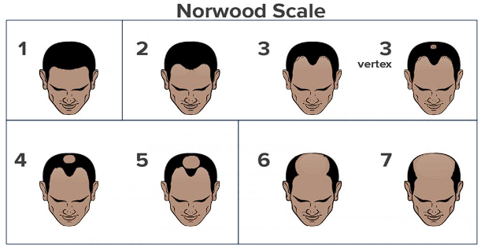

# Male Pattern Baldness Classification

_"Hair Today, Gone Tomorrow: A Deep Dive into AI-Driven Baldness Detection"_

## 🚀 Project Overview

Male Pattern Baldness (MPB), or androgenetic alopecia, affects 50% of men by the age of 50 and can begin as early as the teenage years. However, current diagnosis methods rely on manual inspection and subjective assessments, leading to inconsistencies and late detection.

This project introduces an AI-powered solution that automates MPB classification based on the Norwood Scale, eliminating the need for expensive genetic testing and dermatology consultations.

## 🏆 Key Features

- ✔ AI-based Classification: Uses deep learning to detect MPB stages.
- ✔ Non-Invasive & Accessible: No need for expensive medical tests.
- ✔ Scalable & Efficient: Can process large datasets with minimal human intervention.
- ✔ User Input Refinement: Adjusts results based on age, smoking habits, and race for a more personalized diagnosis.

## ✅ Objectives

- 🔹 Automates phenotypic analysis of MPB stages using the Norwood Scale.
- 🔹 Uses deep learning models for classification.
- 🔹 Provides a reliable, accessible, and cost-effective AI-driven tool.
- 🔹 Provides the user with a cost estimate of transplant surgeries in various regions.

## 📊 Data Overview & EDA

### 📌 Initial Dataset:

🔹 125 high-resolution scalp images (~32 per group).

### 📌 Data Augmentation:

- 🔹 Expanded to 775 images using:

  - Brightness & saturation adjustments
  - Geometric transformations (flipping, rotation)

### 📌 Key Features:

- ✔ MPB Stages: Classified into 4 groups based on the Norwood Scale (as shown in the image above).
- ✔ Additional Attributes: Race, Age, Smoking habits.
- ✔ Preprocessing: Resized to 256×256, converted to grayscale, and normalized.

### 📌 Correlation Analysis:

- ✅ Age & Baldness: Strong positive correlation (r=0.88) – significant predictor of progression.
- ✅ Smoking & Baldness: Moderate correlation (r=0.64) – notable association.
- ✅ Race & Baldness: Negative correlation (r=-0.12) – possibly dataset-dependent.

## 🧠 Model Overview

We developed three models for Male Pattern Baldness (MPB) classification:

1. Annotation Model
2. FEv1
3. FEv4

Unlike FE v1 and FE v4, which classify directly from images, the Annotation Model first segments the scalp and hair using U-Net, creating a preprocessed mask. This mask is then classified separately, making the approach more interpretable but requiring an additional annotation step.

A block Diagram of FEv4:

## 🔬 Model Comparison

| Feature/Aspect            | Annotation Model                                                    | FE v1                                                               | FE v4                                                                             |
| ------------------------- | ------------------------------------------------------------------- | ------------------------------------------------------------------- | --------------------------------------------------------------------------------- |
| **Architecture**          | U-Net for segmentation                                              | Custom CNN (11 layers)                                              | Custom CNN (with dense layers)                                                    |
| **Key Layers**            | Encoder-decoder structure, Pixel-wise classification                | 3 Conv layers (32, 64, 128 filters), Flatten, Dense layers, Dropout | 3 Conv layers (32, 64, 128 filters with Batch Norm), Dense (128 neurons), Dropout |
| **Activation Functions**  | Softmax for segmentation                                            | ReLU (Conv layers)                                                  | ReLU (Conv layers), Softmax (output layer)                                        |
| **Training Method**       | Adam Optimizer, Loss function not specified                         | Adam Optimizer, Sparse Categorical Crossentropy loss                | Cosine Annealing, Early Stopping, ModelCheckpoint                                 |
| **Output**                | Segmentation masks with pixel-wise classes: background, hair, scalp | Multi-class classification                                          | Multi-class classification (4 classes for baldness stages)                        |
| **Performance Accuracy**  | 63%                                                                 | 83%                                                                 | **96%**                                                                           |
| **Model Enhancements**    | Focused on segmentation with U-Net                                  | Baseline CNN model                                                  | Added Batch Norm, Dropout, Cosine Annealing for Learning Rate                     |
| **Key Features**          | Segmentation masks for classification                               | Lightweight CNN model                                               | Advanced architecture with stability and regularization                           |
| **Special Features**      | U-Net for detailed segmentation                                     | Sparse Categorical Crossentropy                                     | Cosine Annealing, ModelCheckpoint                                                 |
| **Precision (Group 1)**   | 0.67                                                                | 0.76                                                                | **1.00**                                                                          |
| **Recall (Group 1)**      | 0.20                                                                | 0.85                                                                | **0.97**                                                                          |
| **F1-Score (Group 1)**    | 0.31                                                                | 0.80                                                                | **0.98**                                                                          |
| **Precision (Group 2)**   | 0.88                                                                | 0.81                                                                | **0.96**                                                                          |
| **Recall (Group 2)**      | 0.58                                                                | 0.84                                                                | **1.00**                                                                          |
| **F1-Score (Group 2)**    | 0.70                                                                | 0.82                                                                | **0.98**                                                                          |
| **Precision (Group 3)**   | 0.27                                                                | 0.86                                                                | **1.00**                                                                          |
| **Recall (Group 3)**      | 1.00                                                                | 0.71                                                                | **0.86**                                                                          |
| **F1-Score (Group 3)**    | 0.42                                                                | 0.78                                                                | **0.92**                                                                          |
| **Precision (Group 4)**   | -                                                                   | 0.89                                                                | **0.90**                                                                          |
| **Recall (Group 4)**      | -                                                                   | 0.89                                                                | **1.00**                                                                          |
| **F1-Score (Group 4)**    | -                                                                   | 0.89                                                                | **0.95**                                                                          |
| **Overall Accuracy**      | 50%                                                                 | 82%                                                                 | **96%**                                                                           |
| **Macro Avg F1-Score**    | 0.48                                                                | 0.82                                                                | **0.96**                                                                          |
| **Weighted Avg F1-Score** | 0.51                                                                | 0.82                                                                | **0.96**                                                                          |

